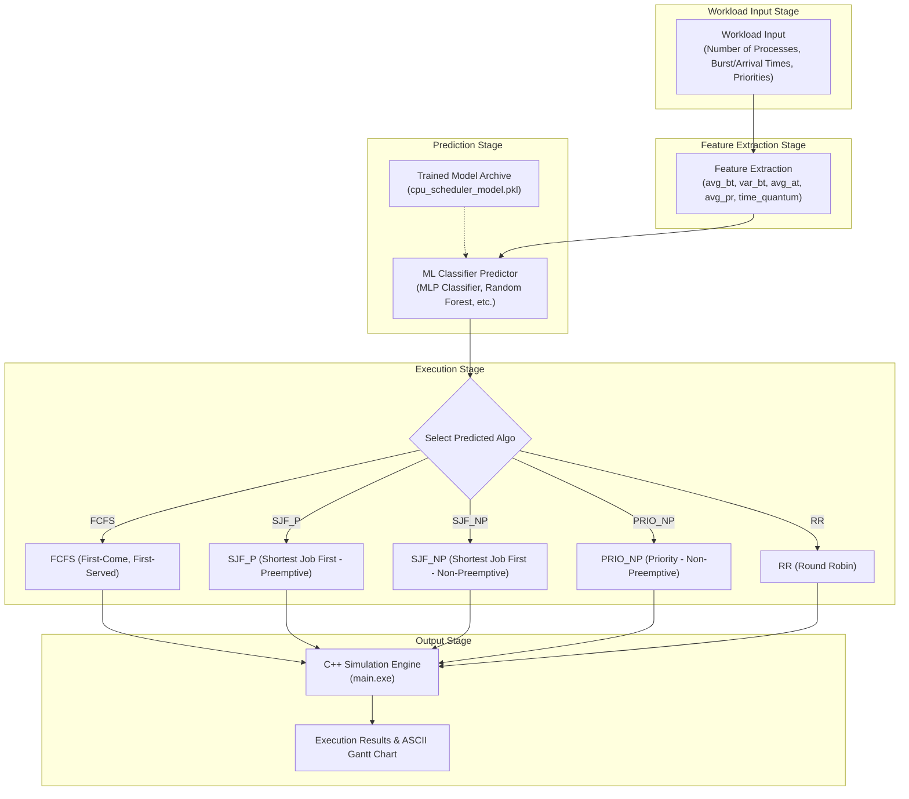

# Academic Project Report: ML-Based CPU Scheduling Optimizer

---

## 1. Methodology

The primary objective of this project is to implement a hybrid framework that leverages machine learning to predict the optimal CPU scheduling algorithm for a given workload. Instead of running expensive computations across multiple algorithms, the ML model predicts the best algorithm based on summary statistics of the process workload.

The methodology is divided into four distinct stages: workload generation, feature extraction, model selection/training, and execution.

### A. System Architecture

The overall flow of the predictive scheduler is shown in **Figure 1**:

*Figure 1: Flowchart illustrating the workload generation, feature extraction, ML classification, and execution pipeline.*

---

### B. Workspace Design & Components

1. **Low-Level Simulation (C++ Engine)**:
   A high-performance C++ simulator (`scd/main.cpp`) compiles into `main.exe` and handles the precise scheduling simulations of 5 different scheduling algorithms:
   * **FCFS** (First-Come, First-Served)
   * **SJF_NP** (Shortest Job First - Non-Preemptive)
   * **SJF_P** (Shortest Job First - Preemptive / SRTF)
   * **PRIO_NP** (Priority-Based - Non-Preemptive)
   * **RR** (Round Robin)

2. **Automated Dataset Generation (`dataset/generate_dataset.py`)**:
   Generates synthetic workloads with:
   * Number of processes ($n$) in range $[4, 12]$
   * Burst times ($BT$) in range $[1, 25]$
   * Arrival times ($AT$) in range $[0, 20]$
   * Priorities ($PR$) in range $[1, 10]$
   * Time quantum ($TQ$) in range $[1, 4]$

   For each workload, the script runs the C++ simulator with all 5 algorithms, parses the average waiting time ($AWT$), selects the algorithm with the lowest average waiting time, and labels it as the `best_algo`.

3. **Machine Learning Classifier Pipeline (`ml/train_model.py`)**:
   Loads the dataset, splits the features and target labels into train/test sets, trains 21 different classifiers, and picks the most accurate model.

---

### C. Feature Engineering

To train the machine learning models, summary statistics are extracted from each generated process workload. These statistics serve as the 6 model features:

| Feature Name | Description | Mathematical Expression / Type |
|---|---|---|
| **`n_proc`** | Total number of processes in the workload | Integer ($n \in [4, 12]$) |
| **`avg_bt`** | Mean burst time of all processes | $\mu_{BT} = \frac{1}{n}\sum_{i=1}^{n} BT_i$ |
| **`var_bt`** | Variance of burst times (represents workload heterogeneity) | $\sigma^2_{BT} = \frac{1}{n}\sum_{i=1}^{n} (BT_i - \mu_{BT})^2$ |
| **`avg_at`** | Mean arrival time of processes | $\mu_{AT} = \frac{1}{n}\sum_{i=1}^{n} AT_i$ |
| **`avg_pr`** | Mean priority value of the workload | $\mu_{PR} = \frac{1}{n}\sum_{i=1}^{n} PR_i$ |
| **`time_quantum`**| Time quantum configured for the Round Robin algorithm | Integer ($TQ \in [1, 4]$) |

---

## 2. Experimental Results

Experiments were conducted on a dataset containing **5,000** randomly generated process workloads. We evaluate the characteristics of the dataset and compare the performance of 21 machine learning classifiers.

### A. Dataset Distribution Analysis

The class distribution highlights which scheduling algorithm produced the lowest average waiting time for the workloads.

#### Table 1: Dataset Class Distribution
| Best Scheduling Algorithm (Class) | Workloads Won | Percentage Representation (%) |
|:---|:---:|:---:|
| **SJF_P** (Preemptive SJF / SRTF) | 1,683 | 84.15% |
| **SJF_NP** (Non-Preemptive SJF) | 209 | 10.45% |
| **RR** (Round Robin) | 83 | 4.15% |
| **PRIO_NP** (Non-Preemptive Priority) | 19 | 0.95% |
| **FCFS** (First-Come, First-Served) | 6 | 0.30% |
| **Total** | **5,000** | **100.00%** |

*Analysis*: Preemptive Shortest Job First (`SJF_P`) is mathematically provably optimal for minimizing average waiting times on single processors, explaining its dominance (84.15%).

#### Table 2: Feature Means Grouped by Class
| Algorithm Class | `n_proc` | `avg_bt` | `var_bt` | `avg_at` | `avg_pr` | `time_quantum` |
|:---|:---:|:---:|:---:|:---:|:---:|:---:|
| **FCFS** | 4.17 | 7.31 | 22.64 | 12.05 | 3.01 | 2.33 |
| **PRIO_NP** | 4.84 | 10.78 | 27.91 | 10.44 | 2.86 | 2.26 |
| **RR** | 4.47 | 8.86 | 24.30 | 11.93 | 2.91 | 2.58 |
| **SJF_NP** | 7.44 | 10.89 | 23.37 | 9.59 | 3.01 | 2.52 |
| **SJF_P** | 8.29 | 10.50 | 29.71 | 9.87 | 3.00 | 2.57 |

---

### B. Machine Learning Model Comparison

The 5,000 workloads were split into **80% training** and **20% testing** sets. 21 models were trained and compared.

#### Table 3: Model Accuracy Rankings
| Rank | Machine Learning Model | Accuracy (%) |
|:---:|:---|:---:|
| **1** | **MLP Classifier (Neural Network)** | **83.50%** |
| 2 | Gaussian Naive Bayes | 83.25% |
| 3 | Random Forest | 83.00% |
| 4 | Extra Trees | 83.00% |
| 5 | AdaBoost | 83.00% |
| 6 | Logistic Regression | 83.00% |
| 7 | Perceptron | 83.00% |
| 8 | Linear Discriminant Analysis (LDA) | 83.00% |
| 9 | Support Vector Classifier (SVC RBF) | 82.75% |
| 10 | Ridge Classifier | 82.75% |
| 11 | Bernoulli Naive Bayes | 82.75% |
| 12 | Linear Support Vector Classifier | 82.50% |
| 13 | Gradient Boosting Classifier | 82.00% |
| 14 | Multinomial Naive Bayes | 81.00% |
| 15 | K-Nearest Neighbors (KNN) | 80.50% |
| 16 | Bagging Classifier | 80.50% |
| 17 | Hist Gradient Boosting Classifier | 80.00% |
| 18 | Passive Aggressive Classifier | 77.25% |
| 19 | Extra Tree (Single) | 72.00% |
| 20 | Decision Tree | 69.50% |
| 21 | SGD Classifier | 69.25% |

*Figure 2: Horizontal bar chart comparing the accuracy of the 21 machine learning classifiers on the test set.*

*Discussion*: The **MLP Classifier (Multi-Layer Perceptron)** achieved the highest performance with **83.50% accuracy**, closely followed by Gaussian Naive Bayes (83.25%). The clustering of scores around 83% reflects the underlying class skew towards the optimal `SJF_P` scheduling algorithm.

---
